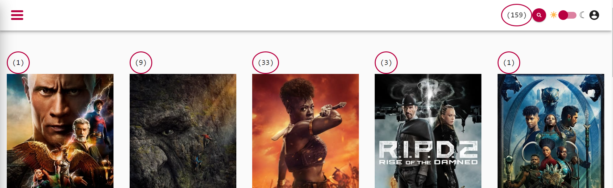

# ChangeDetectionStrategy OnPush Exercises

In this exercise we will focus on basic runtime optimizations in angular applications by using our knowledge about
the `ChangeDetection` system in angular.

## Goal

The goal of this exercise is to give you a deep understanding of the `ChangeDetection` system in angular. We will learn
how to optimize our applications runtime performance by using `ChangeDetectionStrategy.OnPush`.

## Create a dirty checks component

First we will create a component that will help us to debug change detection cycles in our application.

Your task is to create a `DirtyChecksComponent` (and `DirtyChecksModule`) which should serve as a performance debug utility.
Whenever the application renders, it should increase a number in its template.

To do so, the component should bind a `renders()` function inside the template which
simply increase a local numeric variable everytime getting called.

For the template use a `<code>` tag with the class `.dirty-checks`.

<details>
    <summary>hint for the template</summary>

```html
<code class="dirty-checks">({{ renders() }})</code> 
```
</details>

Afterwards, use the component in the `AppComponents` template and serve the application.

<details>
    <summary>show solution</summary>

```bash
# generate component
ng g c shared/dirty-checks --standalone
```

```typescript
// dirty-checks.component.ts

import { Component, ElementRef, NgModule } from "@angular/core";

@Component({
  selector: "dirty-checks",
  template: ` <code class="dirty-checks">({{ renders() }})</code> `,
  styles: [
    `
      :host {
        display: inline-block;
        border-radius: 100%;
        border: 2px solid var(--palette-secondary-main);
        padding: 1rem;
        font-size: var(--text-lg);
      }
    `,
  ],
  standalone: true
})
export class DirtyChecksComponent {
  private _renders = 0;

  renders() {
    return ++this._renders;
  }
}

```

Add import in `app.module.ts`:

```typescript
// Exercise 3: Include dirty checks component import here.

import { DirtyChecksComponent } from "./shared/dirty-checks.component";
```

And include it in the imports section

```typescript

DirtyChecksComponent,
```

Add `<dirty-checks>` component in `app.component.ts` template:

```html
template: `
<!-- Exercise 3: Add dirty checks here -->
<app-shell>
  <dirty-checks></dirty-checks>
  <router-outlet></router-outlet>
</app-shell>
`,
```

</details>



## Evaluate initial state of the application

Serve your app and try to interact with the page. You will see counter always go up.
Perform different kinds of actions and note how the counter will increase by different amounts.

* navigate
  * between categories
  * movie-detail
* tilt
* switch dark/light mode

## Use `ChangeDetection.OnPush`

By default, all angular component using `ChangeDetectionStrategy.Default`.
This means a component will be checked (template bindings will be re-evaluated) every time any action happens on the page.
This can cause severe performance issues.

You should aim to use `ChangeDetectionStrategy.OnPush` in all your components.

### AppComponent

Let's do one simple but significant change and make our `AppComponent` use `ChangeDetectionStrategy.OnPush` changeDetection

<details>
    <summary>Use ChangeDetection OnPush</summary>

```typescript
// app.component.ts

@Component({
  selector: 'app-root',
  template: `
    <app-shell>
      <dirty-checks></dirty-checks>  
      <router-outlet></router-outlet>
    </app-shell>
  `,
  changeDetection: ChangeDetectionStrategy.OnPush,
})
```

</details>

Serve the application, note how the counter will still increase on any interaction, but the amount it increases is
way lower than before. This is because the Component now only re-renders when being on a dirty-path.

### MovieCardComponent

In the first example we investigated rendering cycles with the `DirtyChecksComponent` & applied `OnPush` in our root component.
Let's do the same for a `LeafComponent` to get a deeper understanding of rendering cycles in the context of the `ComponentTree`.

* add the `dirty-checks` component to the `MovieCardComponent`s template
* serve the application, interact with the page and observe the counter in the `MovieCardComponent`
* apply `ChangeDetectionStrategy.OnPush` to `MovieCardComponent`
* serve the application, interact with the page and observe the counter in the `MovieCardComponent`

<details>
    <summary>MovieCardComponent OnPush</summary>

```html
<!-- movie-card.component.html -->

<div class="movie-card"
     [tilt]="40">

  <dirty-checks></dirty-checks>
  <!-- other template -->
</div>
```

```ts
// movie-card.component.ts
import { ChangeDetectionStrategy } from '@angular/core';

@Component({
  /* */
  changeDetection: ChangeDetectionStrategy.OnPush,
})
export class MovieCardComponent {}
```

</details>


### Bonus: more ChangeDetectionStrategy.OnPush

Try to think about other components that would benefit from the `OnPush` `ChangeDetectionStrategy` and apply it.
Make sure to first use the `dirty-checks` component in order to measure the improvement.

Feel free to ask questions if anything unexpected happens.


