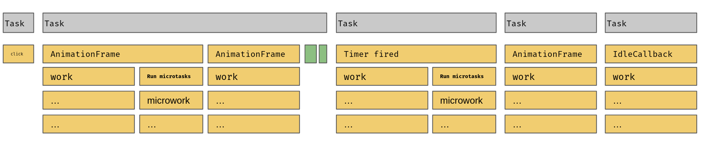

# JS Event Loop Exercise

The goal of this exercise is to deepen your knowledge about the javascript event loop,
the difference between micro- and macrotasks and the execution timings of different
scheduling APIs.

Please write a function that results in the following flamechart.

You can use this plain javascript example as a starting point for your exercise.
[exercise template](https://stackblitz.com/edit/js-v6rset?file=index.js).

> please fork the project :-)




<details>
  <summary>Scheduling APIs</summary>

```ts
// scheduling APIs

setTimeout();
Promise.resolve();
queueMicrotask();
window.requestIdleCallback();
requestAnimationFrame();
```

</details>

