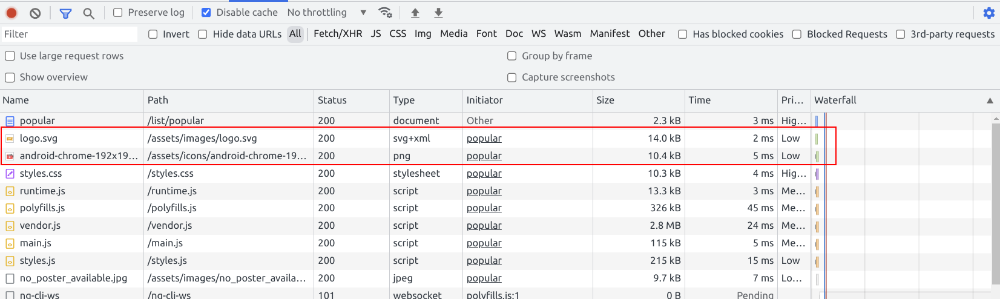
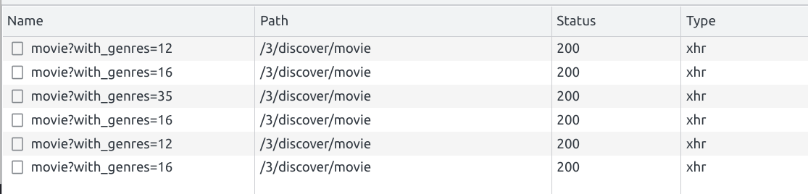
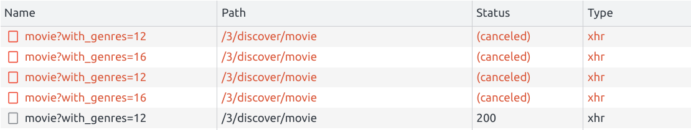

# Network analysis and optimization

Network is where every frontend starts.
We already have an overview of the dev tools "Network" tab and also know about different optimization
techniques.

In this exercise you will learn how to use them. And as a bonus to additional optimizations to improve UX.

## Use `preconnect` to preemptively connect

The Movies app is based on [The Movie Database (TMDB)](https://www.themoviedb.org/) API.
We know for sure that user will need many images from `https://image.tmdb.org/` and will do API requests to
`https://api.themoviedb.org/`.

Your task is to improve the http connection time by using a `<link rel="preconnect" crossorigin="" />` tag in the `index.html`
files `head` for the two known resources.

<details>
    <summary>show solution</summary>

Go to `index.html` and extend `<head>` tag with following:

```html
<!--index.html-->

<link rel="preconnect" href="https://image.tmdb.org/" crossorigin="" />
<link rel="preconnect" href="https://api.themoviedb.org/" crossorigin="" />
```
</details>

Sadly, the outcome of this improvement isn't really measurable with the current application setup :-(.

## Use `preload` to load critical resources

We know for sure our users most likely will see the `logo.svg` as well as the `launcher` (initial loader) on slow connections.
In order to make those elements appear faster for the user, we can `preload` them.

Your task is to preload those two critical resources by again using a `<link />` in the `index.html`s `head`.

* preload `/assets/images/logo.svg`
* preload `/assets/icons/android-chrome-192x192.png`

don't forget to use the correct `as` tag, as it will have an impact on the fetch priority!

<details>
    <summary>show solution</summary>

Go to `index.html` and extend the `<head>` tag with following:

```html
<!--index.html-->

<link rel="preload" as="image" href="/assets/images/logo.svg" />
<link rel="preload" as="image" href="/assets/icons/android-chrome-192x192.png" />
```
</details>

Great, you can verify your changes by inspecting the network traffic of your application on a refresh.

To do so, open "Network" tab in the Chrome Dev tools. Make sure to have `disable cache` checked.
You should see that the requests for the preloaded resources are happening at a very early stage in the waterfall.



Please also note the change in priority when you remove the `as` attribute.

Please verify by commenting out those lines and repeat the measurement.

## Use `prefetch` to preemptively fetch resources

You can use `prefetch` to make a hint to the browser that the resource will be needed for other pages.
Links with this attribute will be preemptively fetched and cached by the browser.
We need a backup image for movies that don't have a poster so let's fetch it.

Your task is to `prefetch` the `assets/images/no_poster_available.jpg` image by
using `link` tag.

Add it to the `index.html` files `head` tag.

<details>
    <summary>show solution</summary>

Go to `index.html` and extend `<head>` tag with following:

```html
<!-- index.html -->

<link rel="prefetch" href="assets/images/no_poster_available.jpg" />
```

</details>

Great, you can verify your changes by inspecting the network traffic of your application on a refresh.

To do so, open "Network" tab in the Chrome Dev tools. Make sure to have `disable cache` checked.
You should see that the request for the prefetched resource is happening right after the javascript bundles are loaded.


## Prefetch http resources as early as possible

Until now, we used native browser features in order to preload/prefetch **static** resources in an early stage.
But what about dynamic resources or resources where we need authentication upfront?
Let's first inspect current state.
Right now the network requests needed to display any meaningful data to the user are tied to component lifecycles. 
This is in general a very bad practice as it is the latest point in time when we actually can execute scripts.

We can observe this behavior by looking from two different angles, the code and the performance analysis.

Start by looking at the code and go to the `AppShellComponent`. You should find a code snippet that requests the `genre` data from the 
`MovieService` and bind it to an `async` pipe in the template.

<details>
  <summary>Show snippet</summary>

```ts
// app-shell.component.ts

readonly genres$ = this.movieService.getGenres();
```

```html
<!--app-shell.component.html-->

<a
  [attr.data-uf]="'menu-gen-'+genre.id"
  *ngFor="let genre of genres$ | async;"
  class="navigation--link"
  [routerLink]="['/list', 'genre', genre.id]"
  routerLinkActive="active"
>

```
</details>

This is a clear indicator for a bad practice, as we start fetching data when the template of
our component gets evaluated.

Let's look at it from the performance analysis.

Open the Performance Tab of the dev tools and start a recording with `Ctrl + Shift + E`.
This will refresh the page and provide you the performance analysis data afterwards.

Go to the `Network` section and search for the request made to
`https://api.themoviedb.org/3/genre/movie/list`. Take a look at the timing when it is queued.

By combining this view with the flame-chart view, you should be able to pinpoint the exact 
location where the request is made in the code: `AppShellComponentTemplate`.


As we now found out where the problem is, let's find a solution.
Your goal is to provide and implement an `APP_INITIALIZER` where we 
will pre-fetch the genre data of the `MovieService`.

For this, we first need to touch the `MovieService` as well as the `AppShellComponent`.

Let's go ahead and introduce a `genre$: Observable<TMDBMovieGenreModel[]>`
as a field in the `MovieService`.
You can also delete the method `getGenres()` as we don't need it anymore.

The `genre$` observable should get assigned to the http call being made before
in `getGenres()`.

The final trick will be to add the `shareReplay` rxjs operator the `genres$` Observable,
as we want to pre-fetch it in an early stage and cache it for later re-usage.

In `AppShellComponent` change the access from `getGenres()` to `genre$`.

<details>
  <summary>Show solution</summary>

```ts
// movie-service.ts

readonly genres$ = this.httpClient
  .get<{ genres: TMDBMovieGenreModel[] }>(
    `${environment.tmdbBaseUrl}/3/genre/movie/list`
  )
  .pipe(
    map(({ genres }) => genres),
    shareReplay({ bufferSize: 1, refCount: true })
  );
```

```ts
// app-shell.component.ts

readonly genres$ = this.movieService.genres$;

```

</details>

Now it's time to finally start pre-fetching our resource.
The goal is to implement an `APP_INITIALIZER` that uses the `MovieService`
kickstart the request to the genres endpoint.

For this, we just need to `subscribe` to the `genres$` Observable, as this will
start the http call.

<details>
  <summary>Show solution</summary>

```ts
// app.module.ts

@NgModule({
  /*other stuff*/
  providers: [
    /*other stuff*/,
    {
      provide: APP_INITIALIZER,
      useFactory: () => {
        const movieService = inject(MovieService);
        return () => {
          // start the http call
          movieService.genres$.subscribe();
        };
      },
      multi: true,
    },
  ]
})
export class AppModule {}
```

</details>


Well done, it's time to validate our improvements!
Repeat the analysis process from before by doing a performance profile of a refresh.

You should now see the timing of the network request has moved from `AppShellComponentTemplate` to
`bootstrap`, very nice job!!


## Cancel not needed requests

In this exercise we will make use of `RxJs` flattening operators in order to control the flow of our HTTP Requests.
Please open the `Network` tab of your Dev Tools. In order to properly measure the results for this exercise I highly recommend
activating network throttling (`Slow 3G`).

Now, inspect the `XHR` requests being made while you navigate between different pages of the application.

You should notice that no request is ever cancelled even though you probably don't need the result anymore.



We can optimise this behavior by using the `rxjs switchMap` operator.

Your task is now to implement business logic that will cancel ongoing requests made to either `genre` or `movie/list/{category}`.
The requests are currently handled in `MovieListPageComponent`. This will be the component you need to introduce changes in order to solve this task.

When you've finished your task, do the network analysis again. You should now see the requests being marked as `cancelled`. 



<details>
  <summary>Show Help</summary>

Introduce a `switchMap` which will automatically unsubscribe the ongoing request when params are changing.

```ts
// movie-list-page.component.ts

this.activatedRoute.params
  .pipe(
    switchMap((params) => {
      if (params['category']) {
        return this.movieService
          .getMovieList(params['category'])
          .pipe(map(({ results }) => results));
      } else {
        return this.movieService.getMoviesByGenre(params['id']);
      }
    })
  )
  .subscribe((movies) => (this.movies = movies));
```

</details>
