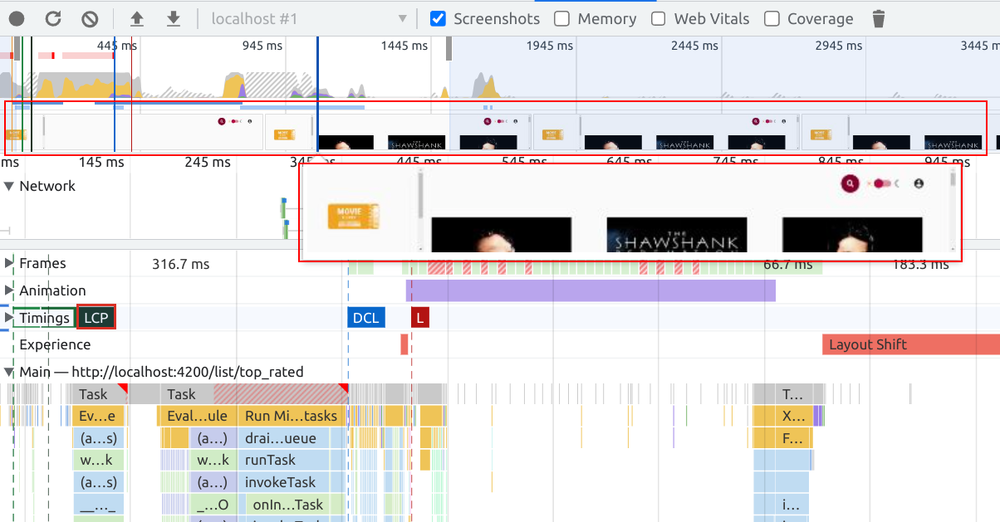
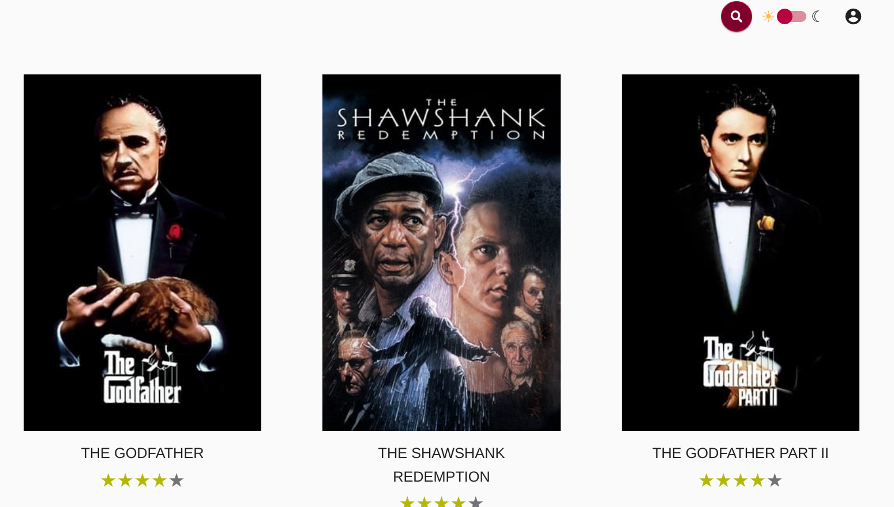
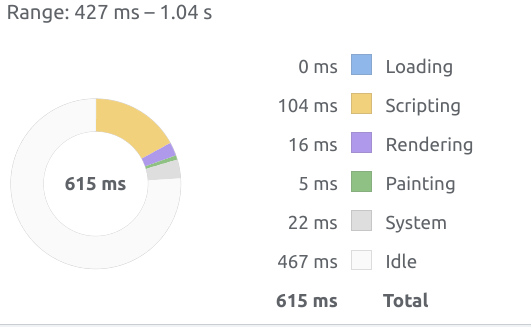
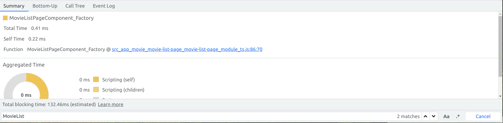
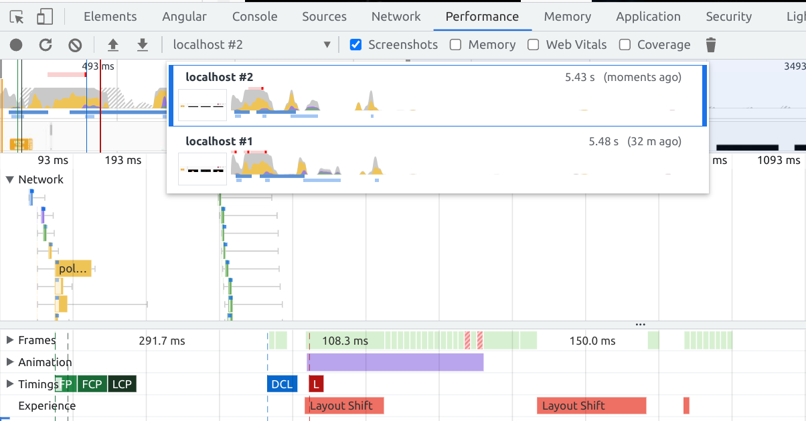
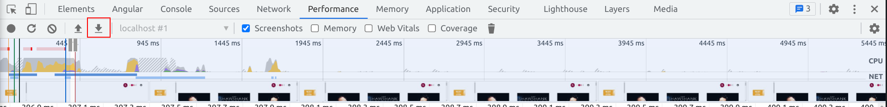
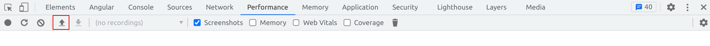

# Performance Tab and Flame Chart analysis

Now that we are aware of the different steps in the browser render pipeline, it's time to apply
this knowledge to the performance analysis process. 
In this exercise you will learn the basics of black box performance auditing by using
the `Performance Tab` of the Chrome Dev Tools.

Before you start, serve the application, open your browser and the dev tools.

**Serve**

```bash
ng serve
```

go to `http://localhost:4200`

**Open Dev Tools**

`F12` or `Ctrl + Shift + I`

## Measure & Identify LCP

Run a bootstrap performance analysis by either hitting `Start profiling and reload page` or
`Ctrl + Shift + E`.


After the report got analysed and is visible for you in the dev tools, search for the `LCP` 
Core Web Vital in the `Timings` pane.

Find out when it is happening and what the browser has identified as `LCP`.

In order to identify the `LCP` you might want to consider taking a look and the `Screenshot` section
of the report.



## Find out how long it takes from visible app-skeleton until list is visible

To solve this task you will again need to take a look at the `Screenshot` section.

Your fast task for this exercise will be to identify the point in time when the initial **loading screen disappears**.

**Initial Loading Screen**


If you have identified it, please go a head and also find the timing when the **movie list data is visible**.

**Movie List Data**



Please mark the corresponding area between those two point in times and report
the values shown in the `Summary` section.

> Tip: you can use the screenshot section to fine-control the visible area. To mark a section
> consider using `Shift + Mouse1`



## Find MovieListComponent bootstrap

In this exercise I want you to use the `search` function in order to search for the
time when the `MovieListComponent` is getting bootstrapped.

Hit `Ctrl + F` in order to conduct a search in the flame charts. 

Find and report the point in time, when `MovieListComponent` is getting bootstrapped.

<details>
  <summary>Show Help</summary>



</details>

## Compare consequent recordings

Please go ahead and do another bootstrap recording as described in
step 1 of this exercise.
After the report was analysed and is visible for you, you'll notice
that the dropdown menu in the top-bar of the Dev Tools is now
enabled.

Switch between the recordings in order to get a feeling of how to
compare multiple recordings in a single
instance of the Chrome Dev Tools. 

You'll most probably notice that the outcome of the measurements can be 
quite different at times. This is the reason
why we always should conduct do multiple recordings!



## Save & import recordings

If you want to share your recording with others, the dev tools provide
you with the feature to save an existing recording.

Hit the export button and save the current recording to disk.



Great, now open your browser to a new empty tab and open a second instance of the 
Chrome Dev Tools by hitting `F12` or `Ctrl + Shift + I`.

Now you can import your formerly saved recording in a new instance, thus
having the ability to compare
multiple recordings directly next to each other.



## Bonus: Find optimisation potential

In this exercise you can now investigate the flame charts on your own and try to find suspicious tasks that
potentially could be reduced, moved or erased completely.

Please not down your findings, so we can discuss them afterwards :-).
