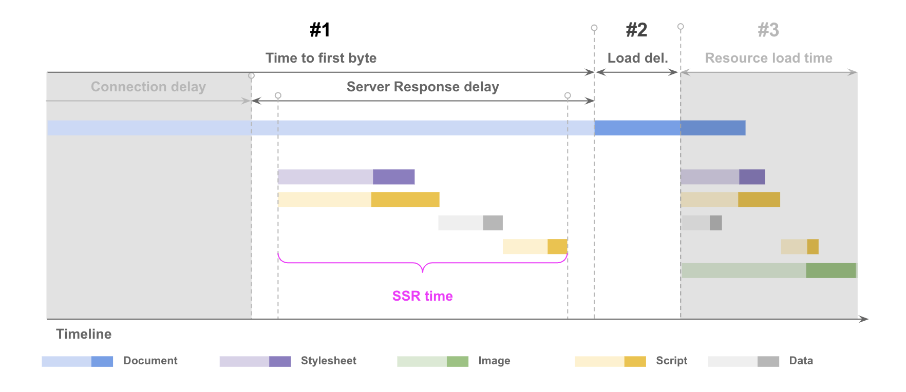
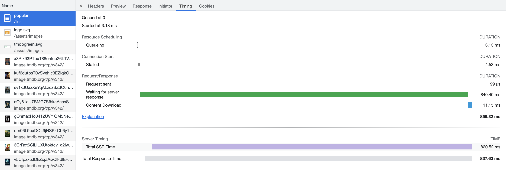
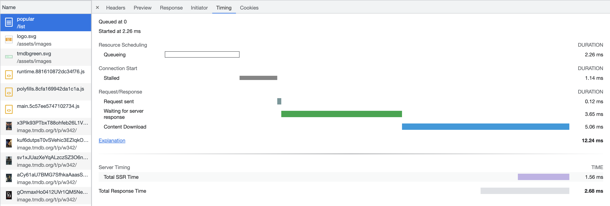
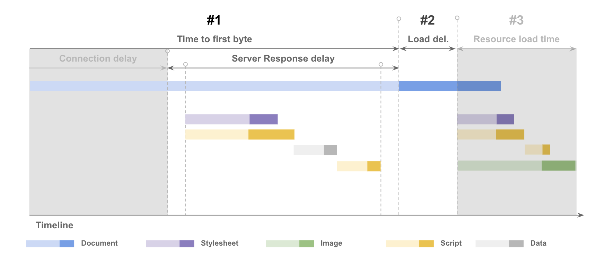
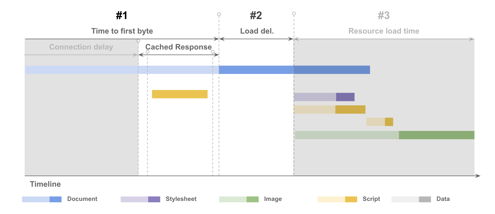

# Pre-rendering Routes

In this exercise we will learn how to reduce the Server Response Delay with pre-rendering.



## Measuring Server Timing
We can configure our server to record `Server Timing` and send it as part of the response.

Install server-timing by running:

```bash
npm install server-timing --save
```

And added to the import to `server-timing` of `server.ts` and call it as a middleware:

```js
import { default as serverTiming } from 'server-timing';

export function app(): express.Express {
    const server = express();
    server.use(serverTiming());
    ...
}
```

Then modify the server to include the server timing:

```js
server.get('*', (req, res) => {
    res.startTime('SSR', 'Total SSR Time');
    res.render(indexHtml, {
        req,
        providers: [
          {
            provide: APP_BASE_HREF,
            useValue: req.baseUrl,
          },
        ],
      },
      (_, html) => {
        res.endTime('SSR');
        res.send(html);
      }
    );
});
```

Rebuild and serve the application to view the Server Timing:

```bash
npm run build:ssr
npm run serve:ssr
```

Open the devtools with `F12` or `Ctrl + Shift + I` and open the `Network Tab`. Create a new Network recording with `Ctrl + R` or by reloading the page.

Open the first request which should be named `popular/list` and the timing of the first request. 

Notice how long the browser waits for the server response:



## Pre-rendering static pages

To prerender the application run: 

```bash
npm run prerender
```

You should now have a file at `dist/angular-perf-ngbe/browser/my-movies/index.html`.

To serve the pre-render application run:

```bash
npm run serve:ssr
```

## Pre-rendering dynamic pages

To prerender dynamic routes e.g. `list/:category` you will need to provide the extra routes. 

Create a new file in the root directory called `routes.txt` and add the following list of routes: 

```txt
/list/popular
/list/top_rated
/list/upcoming
```

Inside the `angular.json` file at in the root directory, change the routes configuration to routesFile with the path to `routes.txt`.

replace:

```json
"routes": [
  "/"
]
```

with:

```json
"routesFile": "routes.txt"
```

Save the changes and prerender the application again by running: 

```bash
npm run prerender
```

Now you should be able to see the pre-rendered routes in `dist/angular-perf-ngbe/browser/`:

```txt
.
|-- ...
|-- list
|   |-- popular
|   |   `-- index.html
|   |-- top_rated
|   |   `-- index.html
|   `-- upcoming
|       `-- index.html
...
```

## Comparison Server Render Timing

Now that pre-rendering is configured we can compare the server rendering performance with `Server Timing`.

Now serve the pre-render application by running:

```bash
npm run prerender
npm run serve:ssr
```

Open the devtools with `F12` or `Ctrl + Shift + I` and open the `Network Tab`. Create a new Network recording with `Ctrl + R` or by reloading the page.

Open the first request which should be named `popular/list` and the timing of the first request.

Notice how long the browser waits for the server response compared to the server side rendered application:





| BEFORE                                                                           | AFTER                                                    |
|----------------------------------------------------------------------------------|----------------------------------------------------------|
|                            |  |
|  |        |
