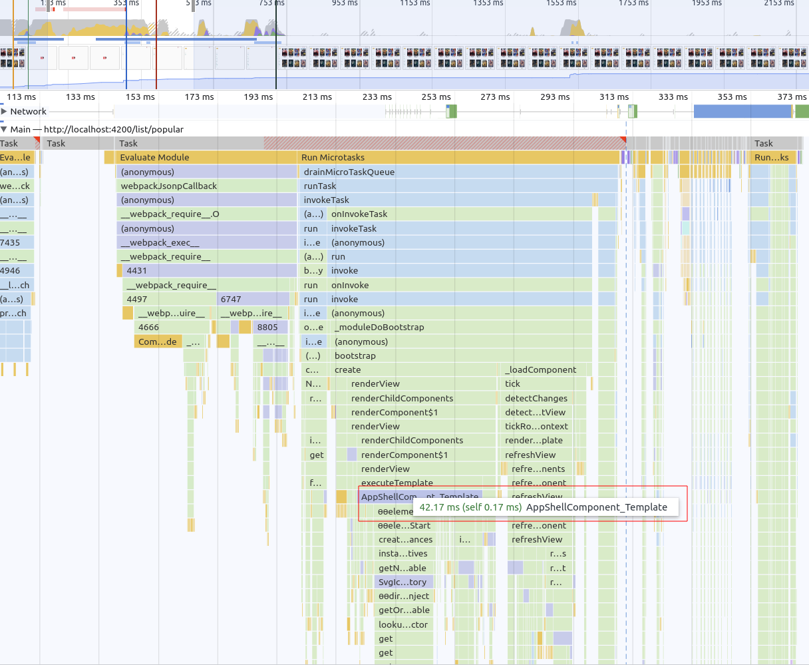
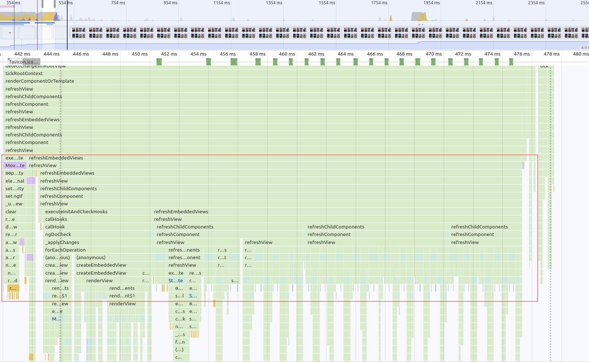

# Scheduling Exercise: Split Template Work


We learned about how we can use scheduling techniques in order to split up hard work in smaller
pieces. Let's go ahead and split a piece of work into a new chunk!

This exercise is about getting to know how to analyze the work executed by our application. You will
use the `dev tools Performance Tab` in order to search for `long tasks` and measure the outcome of your 
applied changes.
By using the directives provided by the `@rx-angular/template` package, you will have an easy time
splicing up the rendering work of your application.

## Improve AppShell

Go ahead and do an analysis of the bootstrap performance of the application. 

Serve the movies app and open your browser on the served `host:port`.

```bash
ng serve

# or

npm run start
```

Also open the `Performance Tab` of the devtools.

<details>
  <summary>Show Help</summary>


</details>


Now run `Start profiling and reload page (Ctrl + Shift + E)` and inspect the recording.

<details>
  <summary>Show Help</summary>


</details>

You should notice a huge `long task` in the beginning of the bootstrap phase, connected to `AppShellComponent`

<details>
  <summary>Show Help</summary>



</details>

This looks awful! Let's try to improve the bootstrap time (`TBT (Total Blocking Time)`)
of our application by reducing the work of the initial chunk of work.

We can do so by literally just adding a simple `structural directive` to the `app-shell.component.html`.

Introduce the `rxLet` directive on the `ui-side-drawer` element with an empty `[]` as input.

<details>
  <summary>Show Help</summary>

```html
<!-- app-shell.component.html -->

<ui-side-drawer
  [opened]="sideDrawerOpen"
  (openedChange)="sideDrawerOpen = $event"
  *rxLet="[]"
>
</ui-side-drawer>

<!-- other template -->
```

</details>

After applying the changes, run `Start profiling and reload page (Ctrl + Shift + E)`
again and inspect the new recording.

Search for a task named `performWorkUntilDeadline` which now should include parts of the `AppShellComponent`s
work.

You should also notice the reduced workload on the first `long task` you've detected earlier.

<details>
  <summary>Show Result</summary>


</details>

### Bonus: move more work

If you like you can also just create an empty `ng-container` around the whole template of
the `app-shell.component.html`. This will result in a bigger chunk moved from the bootstrap phase
of the application. Make sure to measure the outcome!

<details>
  <summary>Show Help</summary>

```html
<!-- app-shell.component.html -->
<ng-container *rxLet="[]">

  <ui-side-drawer
    [opened]="sideDrawerOpen"
    (openedChange)="sideDrawerOpen = $event"
  >
  </ui-side-drawer>
  
  <!-- other template -->
  
</ng-container>

```

</details>


Great job!! You have successfully detected a `long task` and reduced its workload by splicing up the
work. Btw. you've also improved the bootstrap time of your application. Love it :-)

Let's level up a bit and apply more improvements!

## Chunked List Rendering

Open the dev tools again and do a new performance recording.
You don't need to run `Start profiling and reload page` this time, it is sufficient to simply
start a recording and navigate around the application.

After doing one of the approaches before, search for the task where `ngFor` creates the nodes
for the `movie-cards` in the `flamecharts`.

It is probably connected to an `XHR Load` event and causes lots of `refreshView` calls.

<details>
  <summary>Show Help</summary>



</details>

With your knowledge about scheduling the identified pattern should already trigger some thoughts
about what we want to do with this one here :).
You should notice that there is a lot of repeated work done in a single task which could easily be split up.

Let's do so by switching the `ngFor` to `rxFor` in the `movie-list.component.html` template.

<details>
  <summary>Show Help</summary>

```html
<!--movie-list.component.html-->

<div class="movie-list">
  <movie-card
    (selected)="navToDetail($event)"
    [movie]="movie"
    *rxFor="let movie of movies">

  </movie-card>
</div>
```

</details>

The `rxFor` directive should make sure to render list items by keeping the frame budget of `60 fps` in mind.

Do another performance recording of the movie-list and search for the chunked list rendering pattern.

> Depending on your hardware, you maybe need to turn on `CPU throttling`

<details>
  <summary>CPU Throttling</summary>


</details>

<details>
  <summary>Rx For Chunks</summary>


</details>


Well done! You have successfully mastered the single-thread :-)


## Bonus: Introduce `rxFor` to genre list

Just as you did before, replace `ngFor` with the `rxFor` directive in the `app-shell.component.html` template
at the place where the `genre$` data is rendered.

Make sure to measure the result!
