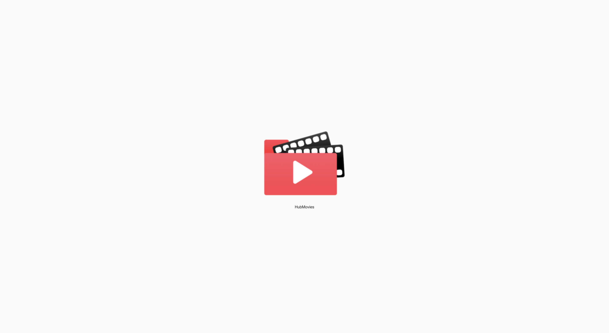
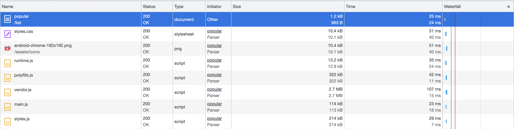
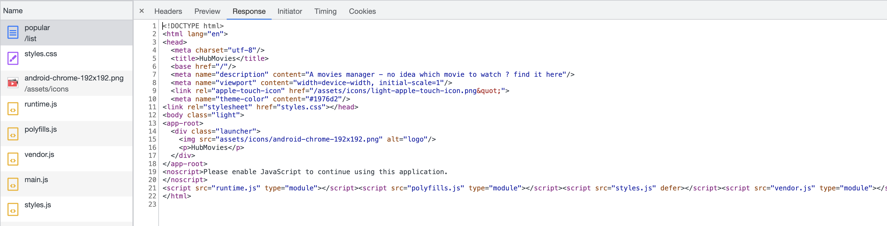
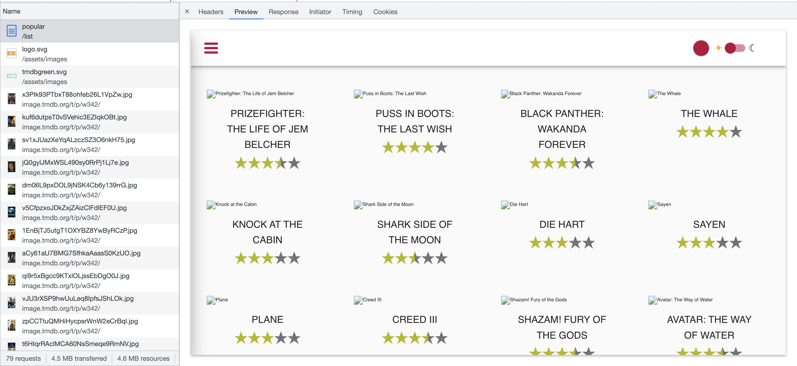
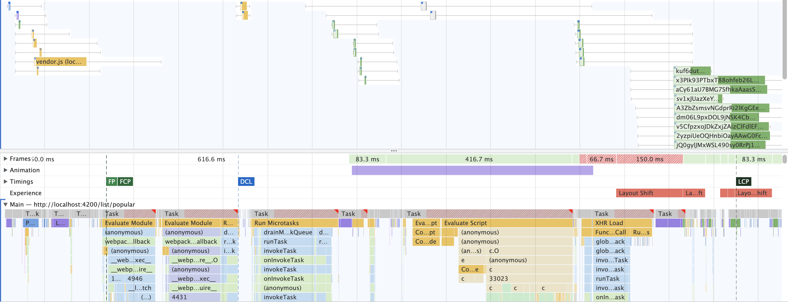
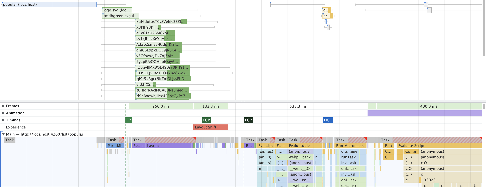
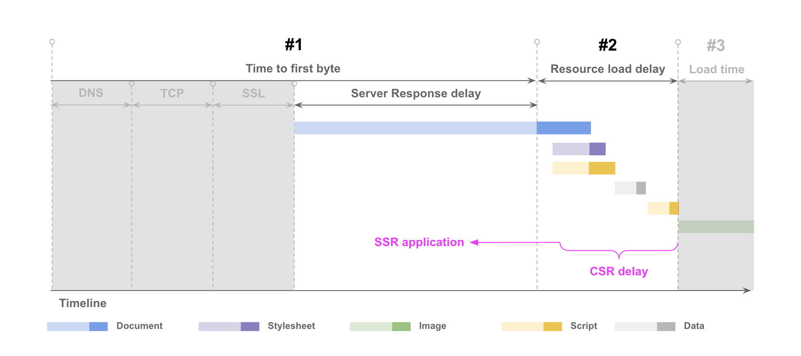
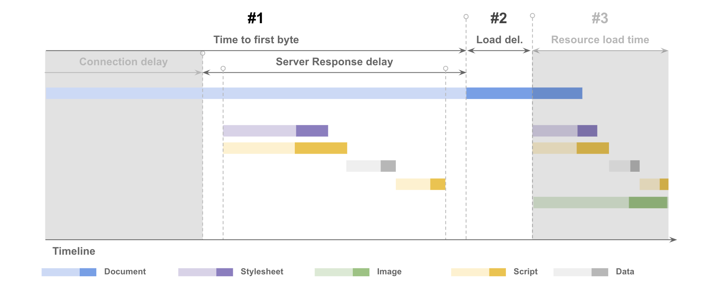

# Server Side Rendering - Angular Universal

In this exercise you will learn how to set up Server Side Rendering (SSR) using Angular Universal.


## Client Side Rendered (CSR)

Start off by measuring the current state. Open your browser to show you any movie list, e.g. `http://localhost:4200/list/popular`.

You should see the initial loading screen displayed on the browser.



Open the devtools with `F12` or `Ctrl + Shift + I` and open the `Network Tab`. Create a new Network recording with `Ctrl + R` or by reloading the page.

You should see all the network request made by the initial navigation. 



Open the first request which should be named `popular/list`

You should find that the html document is almost identical the index.html located at the root of the application `src/index.html`.



## Installing Angular Universal

To set up SSR run: 

```bash
ng add @nguniversal/express-engine
```

You should see the following output in the console:

```
CREATE src/main.server.ts (60 bytes)
CREATE src/app/app.server.module.ts (318 bytes)
CREATE tsconfig.server.json (272 bytes)
CREATE server.ts (2034 bytes)
UPDATE package.json (1417 bytes)
UPDATE angular.json (4827 bytes)
UPDATE src/app/app.module.ts (926 bytes)
UPDATE src/app/app-routing.module.ts (1507 bytes)
```

You will also need to add the following import as the first import in `main.server.ts` to initialize the server environment and provided shims such as DOM Globals:

```typescript
import '@angular/platform-server/init';
```

This is because of a third-party dependency and is necessary to be able to build run the application.

Now that the application is configured to run on the server run:

```bash
npm run dev:ssr
```

## Handling third-party scripts in on the server

Some third party script require additional configuration to work on the server.
By trying to navigate to any movie list, e.g. `http://localhost:4200/list/popular`, you should see the following error:

```
ERROR ReferenceError: window is not defined
at new SvgLoadStrategyImpl
```

To fix it you will need to insert the following import and configuration into `app.server.module.ts`

```typescript
FastSvgModule.forRoot({
  svgLoadStrategy: SvgLoadStrategySsr,
  url: (name: string) => `assets/svg-icons/${name}.svg`,
})
```

## Handling browser APIs over DI

A common problem when using SSR is the lack of browser global variables in the server. 
One solution is to use dependency injection (DI) to provide the globals through the angular platform.

By trying to navigate to any movie list, e.g. `http://localhost:4200/list/popular`, you should see the following error:

```
ERROR ../src/app/app-shell/app-shell.component.scss:218
  &--menu-item {
^

ReferenceError: window is not defined
    at Object.DarkModeToggleComponent.toggleTheme (../src/app/app-shell/app-shell.component.scss:218:1)
```

To fix it, add the following code in the constructor of `DarkModeToggleComponent`.

```typescript
constructor(@Inject(DOCUMENT) private document: Document) {}
```

And replace any mention off `window.document` with `this.document` inside of `DarkModeToggleComponent`.

```typescript
toggleTheme = (isLightTheme: boolean): void => {
  if (isLightTheme) {
    this.document.body.classList.remove('dark');
    this.document.body.classList.add('light');
  } else {
    this.document.body.classList.add('dark');
    this.document.body.classList.remove('light');
  }
};
```

This will allow angular to use a primitive of `window` on the server.

## Comparison of CSR and SSR

Now that SSR is set up you can run a new network recording and compare the results. You should see that the html delivered already has the movies list rendered in html.



You can also see that the LCP images are being downloaded and rendered earlier.

(@TODO Correct images)

| BEFORE                                                                 | AFTER                                                                   |
|------------------------------------------------------------------------|-------------------------------------------------------------------------|
|  |  |
|      |   |
