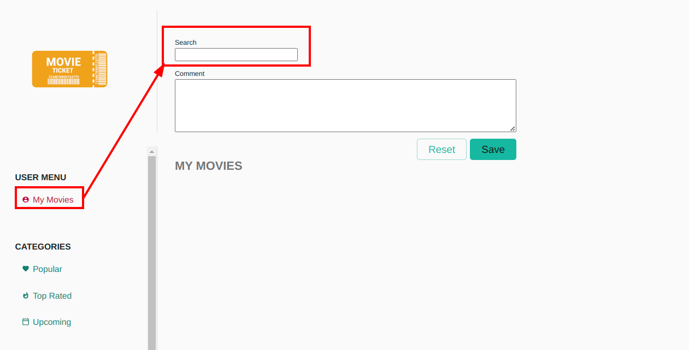

# ChangeDetectionStrategy trackBy exercises

In this exercise we will focus on basic runtime optimizations in angular applications by using our knowledge about
the `ChangeDetection` system in angular.

## Goal

The goal of this exercise is to give you a deep understanding of the `ChangeDetection` system in angular. We will learn
how to optimize our applications runtime performance by using the `trackBy function`.

## MovieSearchControlComponent



Apply the `dirty-checks` component to the template of the `MovieSearchControlComponent`. Add it inside of the `button`
element created for each search result.

<details>
  <summary>Apply DirtyChecks to MovieSearchControlComponent</summary>

```html
<!-- movie-search-control.component.html -->

<button class="movie-result"
        (click)="selectMovie(movie)"
        *ngFor="let movie of movies;">
  
  <dirty-checks></dirty-checks>
  
  
  <span>{{ movie.title }}</span>
</button>
```

</details>

Serve the application, navigate to `/my-movies` and interact with the search-control. In order to force the list to update
already existing elements, try to search for `batman` => `batm` => `batman`...

```bash
ng serve
```
You will see the counter always resetting to 1.

You might think, yeah that's exactly what I've wanted. But, the counter always resetting actually means, the template
always gets destroyed and re-created.

Open the `devtools` and go to the `Elements` tab. Find the result list in the `DOM` and perform a search.
You should see the dom elements getting actually destroyed.

The task is to improve this situation by letting angular know how to identify objects and update the template instead of
re-creating it.

Create a `trackMovie: TrackByFunction` function in `MovieSearchComponent` which returns the `movie.id`.
Apply it as input parameter to the `*ngFor`

[TrackByFunction](https://angular.io/api/core/TrackByFunction)

<details>
    <summary>TrackByFunction</summary>

```ts
// movie-search-control.component.ts
trackMovie = (i: number, movie: MovieModel) => movie.id;
```

```html
<!-- movie-search-control.component.html -->

<button class="movie-result"
        (click)="selectMovie(movie)"
        *ngFor="let movie of movies; trackBy: trackMovie">
    <!-- the template -->
</button>
```

</details>

Serve the application and repeat the interaction with the `MovieSearchControlComponent`. Watch the counter now actually
updating instead of re-instantiating. Also use the `devtools` and inspect the `Elements`. You should now that the Nodes are
getting updated now.

```bash
ng serve
```

## Bonus: MovieSearchPageComponent

Since we have the same kind of issue in our `MovieSearchPageComponent`, lets go there and apply the same fixes as before.

* apply the `dirty-checks` component so that you have visual feedback of your improvement
  * you probably need to dig into `MovieListComponent` since this is the place where the iteration happens
* Repeat the interaction process, but perform it on the global movie search (top widget)
* Inspect the counter & `devtools > Elements` tab
* create a `TrackByFunction` and apply it to the `*ngFor`
* repeat the interaction

If you like, you can use the utility function `trackByProp` from `shared/utils/track-by.ts`
