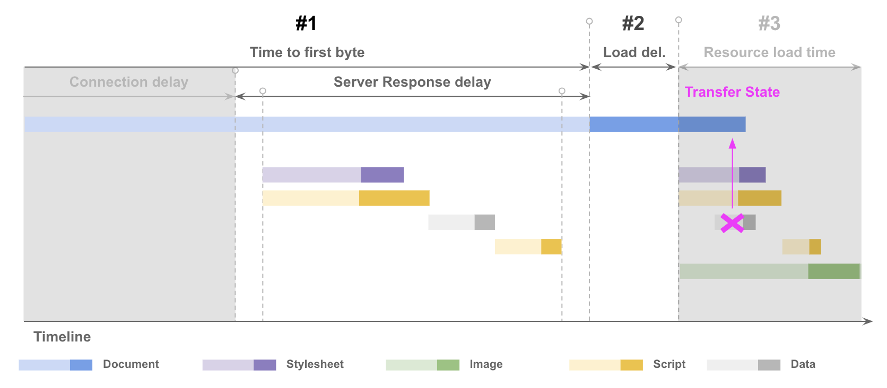
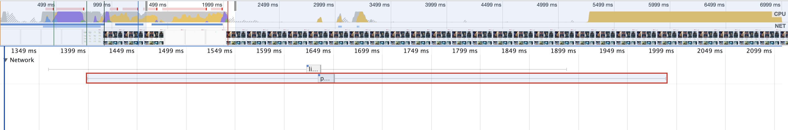
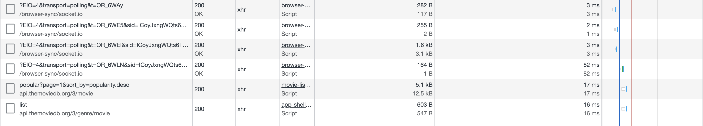
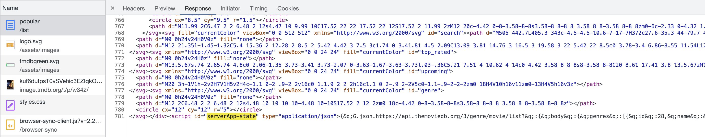

# Transfer State

In this exercise you will learn how stop request from running both on the server and the browser by setting up transfer state.



## Fetching data on the server and client

Start off by measuring the current state. Open your browser to show you any movie list, e.g. `http://localhost:4200/list/popular`.

Open the devtools with `F12` or `Ctrl + Shift + I`, navigate to the `Performance Tab` and create a new recording with `Ctrl + E`.

Identify which request is causing the browser to display the loading spinner and rerender the movies-list component. 



Now you can make a network recording by navigate to the `Network Tab` and pressing `Ctrl + R`.
Filter the results to only get Fetch and XHR request and inspect the request that are responsible for the movies list data. 



## Setting up transfer state

1. Install @nguniversal/common:

```bash
npm install @nguniversal/common --save
```

2. Add TransferHttpCacheModule to your App Module Imports

```js
import {TransferHttpCacheModule} from '@nguniversal/common';

@NgModule({
  imports: [
    BrowserModule.withServerTransition({appId: 'my-app'}),
    TransferHttpCacheModule,
    
    ...
  ],
  bootstrap: [MyApp]
})
export class AppBrowserModule() {}
```

3. Wait until the "DOMContentLoaded" event before bootstrapping the application

Modify the end of the `main.ts` file from:

```js
...

platformBrowserDynamic().bootstrapModule(AppBrowserModule);
```

To this:

```js
...

document.addEventListener("DOMContentLoaded", () => {
platformBrowserDynamic()
.bootstrapModule(AppModule)
.catch(err => console.log(err));
});
```

## Verify transfer state is working

1. Verify network request are no longer duplicated

Open the devtools with `F12` or `Ctrl + Shift + I` and open the `Network Tab`. 
Create a new recording with `Ctrl + R` or by reloading the page.
Filter the results to only get Fetch and XHR request. 


2. Check that the transfer state is in the index.html

Now remove the filter and open the first request which should be named `popular/list`.
Inspect the response and use `Ctrl + F` to find the transfer state in the document. It should be a script tag with an id of `serverApp-state`.



